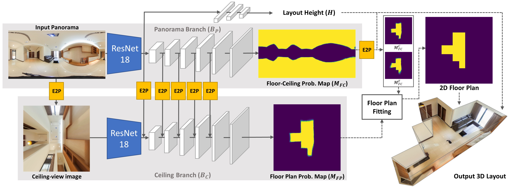
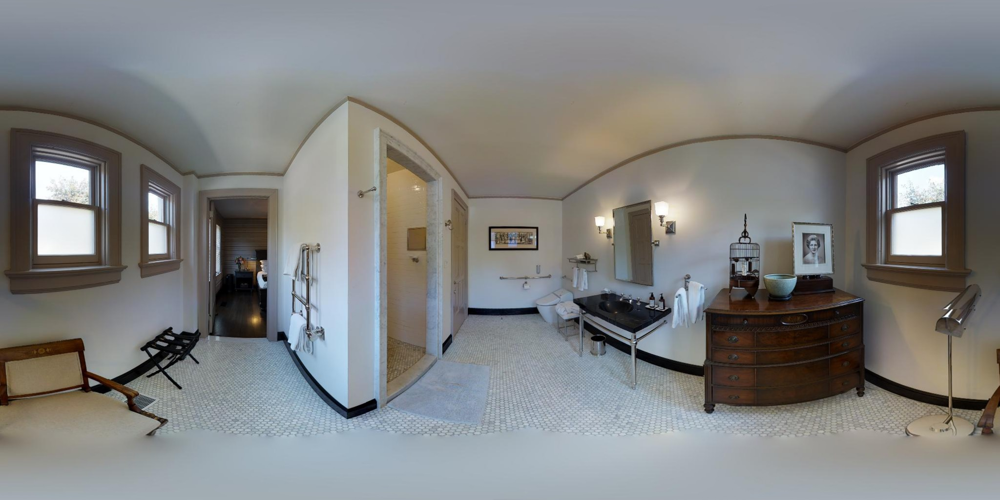
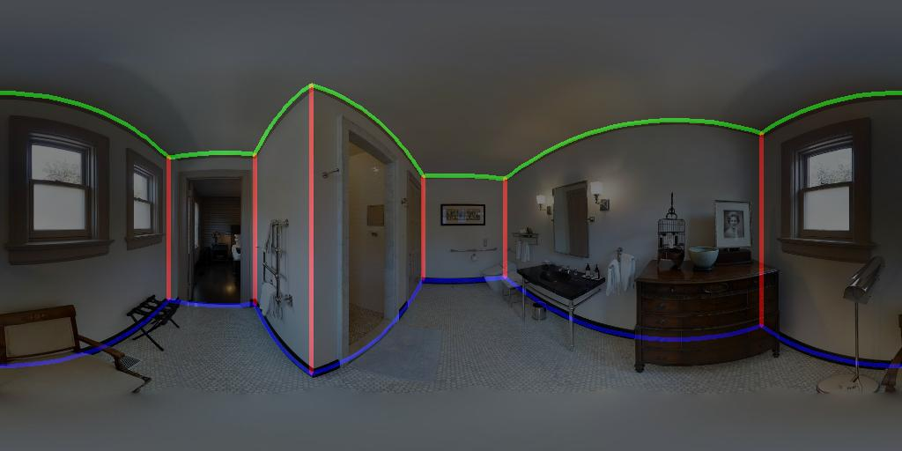
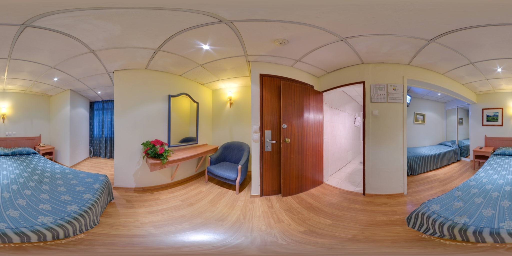
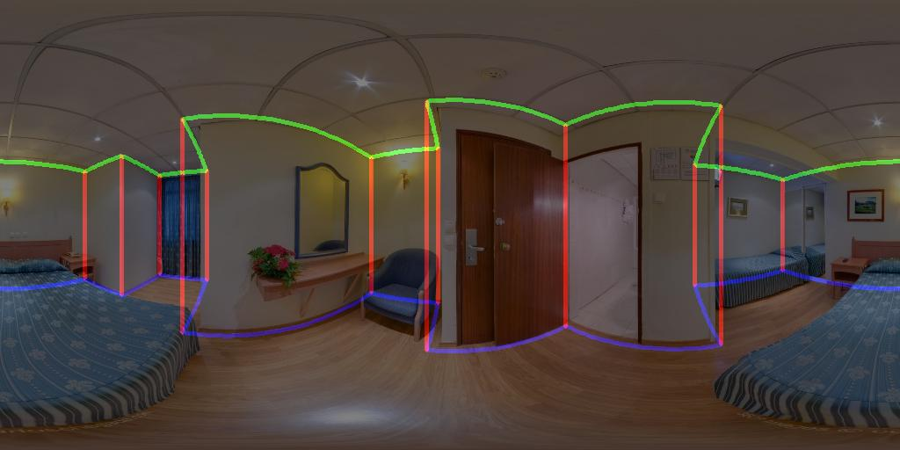
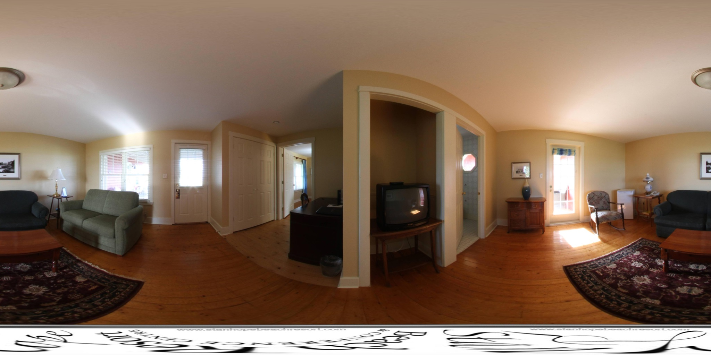
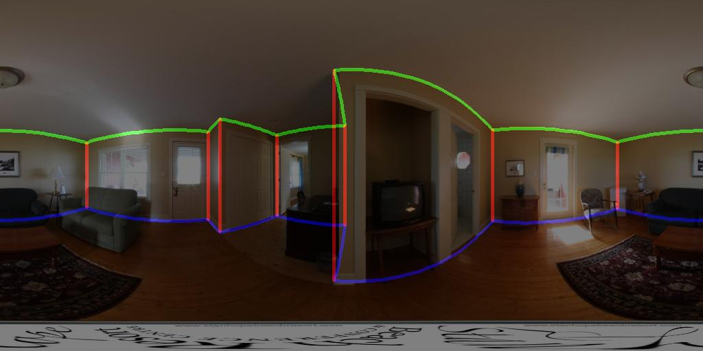
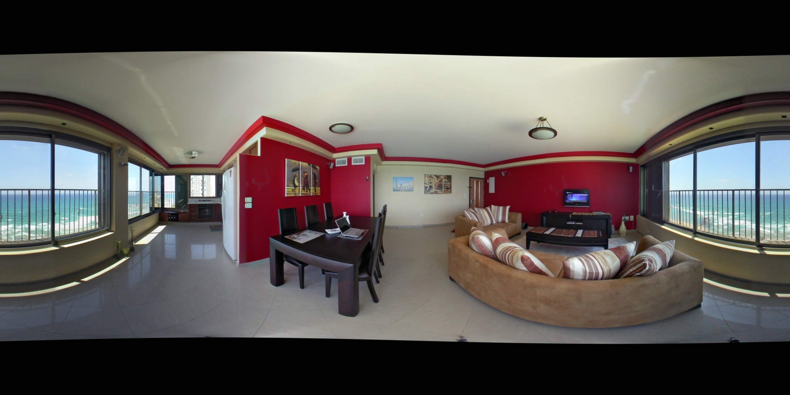
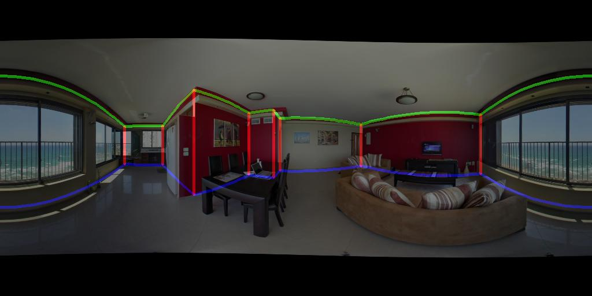

# DuLa-Net
This is the pytorch demo code of our CVPR 2019 paper  
**DuLa-Net: A Dual-Projection Network for Estimating Room Layouts from a Single RGB Panorama ([Arxiv], [Project])**

By this repo you can estimate the 3D room layout from a single indoor RGB panorama. To see more details please refer to the paper or project page.



## Prerequisites
- Python3
- Pytorch (CUDA >= 8.0)
- OpenCV-Python
- Pillow / scikit-image

## Pretrained Model

First, please download the [pretrained models] and copy to ./Model/ckpt/ \
The pretrained models are trained on our Realtor360 dataset with different backbone networks.

## Pre-processing

The input panorama should be already aligned with the Manhattan World. We recommand you using the [PanoBasic] in Matlab or the python implementation [here]. Those tool can help you do the pre-processing to align the panorama.

## Predict

Then using below command to load the pretrained model and predict the 3D layout.

```
python demo.py --input figs\001.jpg
```


If you want to use other backbone networks(default is resnet18).
```
python demo.py --input figs\001.jpg --backbone resnet50 --ckpt Model\ckpt\res50_realtor.pkl
```

## More Results






## Dataset
The Realtor360 dataset currently couldn’t be made publicly available due to some legal privacy issue. Please refer to the MatterportLayout dataset(coming soon), which resembles the Realtor360 in all aspects.

[PanoBasic]: <https://github.com/yindaz/PanoBasic>
[here]: <https://github.com/sunset1995/HorizonNet/blob/master/preprocess.py>
[pretrained models]: <https://drive.google.com/file/d/1AJ-RsVW8XTvlaJ1hzGIMu4L2aDiEWc4z/view?usp=sharing>
[Arxiv]: <https://arxiv.org/abs/1811.11977>
[Project]: <https://cgv.cs.nthu.edu.tw/projects/dulanet>